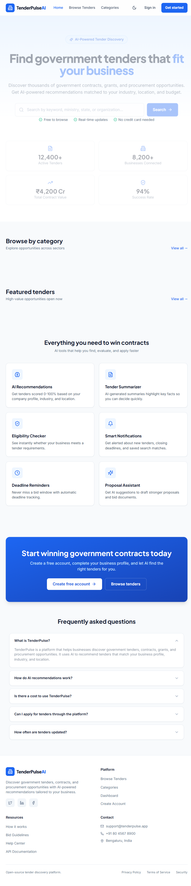
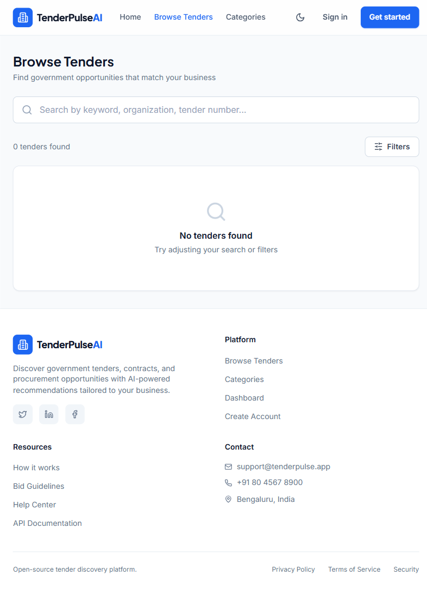
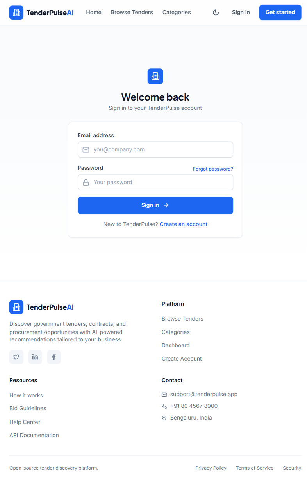

# TenderPulse — Government Tender & Business Opportunity Finder


TenderPulse is an AI-powered platform that helps businesses discover government tenders, contracts, grants, and procurement opportunities. Get AI-powered recommendations tailored to your business profile, industry, and location.

Built with React, TypeScript, Vite, Tailwind CSS, and Supabase.

---

## Table of Contents

- [Screenshots](#screenshots)
- [Features](#features)
- [Getting Started](#getting-started)
- [Docker Setup](#docker-setup)
- [Tech Stack](#tech-stack)
- [Project Structure](#project-structure)
- [Environment Variables](#environment-variables)
- [Contributing](#contributing)
- [License](#license)

---

## Screenshots

### Landing Page


### Browse Tenders


### Login Page


---

## Features

### For Businesses

- **Discover Tenders** — Browse thousands of government tenders, contracts, and procurement opportunities
- **AI-Powered Recommendations** — Get personalized tender suggestions based on your business profile
- **Advanced Search** — Search by keyword, category, location, budget, and deadline
- **Smart Filters** — Filter by industry, tender type, eligibility, and more
- **Bookmarks** — Save and organize tenders for later review
- **Company Profile** — Build your business profile for better matching

### For Administrators

- **Dashboard** — Manage tenders, users, and platform settings
- **Verification** — Verify business profiles and tender listings
- **Analytics** — View platform statistics and user engagement

### Platform Features

- **Dark / Light Theme** — Toggle between themes with persistent preference
- **Responsive Design** — Fully optimized for desktop, tablet, and mobile
- **Real-time Updates** — Live notifications and updates
- **Secure Authentication** — Email/password and OAuth support
- **Role-based Access** — Business user and admin roles

---

## Getting Started

### Prerequisites

- **Node.js** >= 18
- **npm** >= 9

### Installation

```bash
git clone https://github.com/yourusername/tenderpulse.git
cd tenderpulse
npm install
```

### Running the App

```bash
npm run dev
```

Open `http://localhost:5173`.

---

## Docker Setup

```bash
docker compose up --build
```

Opens on `http://localhost:5173`.

```bash
docker compose down
```

---

## Tech Stack

| Technology | Purpose |
|------------|---------|
| **React 18** | UI library |
| **TypeScript** | Type safety |
| **Vite 5** | Build tool |
| **Tailwind CSS 3** | Styling |
| **Supabase** | Backend & auth |
| **React Router 6** | Routing |
| **Lucide React** | Icons |

---

## Project Structure

```
tenderpulse/
├── src/
│   ├── components/
│   │   ├── Navbar.tsx
│   │   ├── Footer.tsx
│   │   └── TenderCard.tsx
│   ├── pages/
│   │   ├── LandingPage.tsx
│   │   ├── BrowsePage.tsx
│   │   ├── TenderDetailPage.tsx
│   │   ├── CategoriesPage.tsx
│   │   ├── LoginPage.tsx
│   │   ├── RegisterPage.tsx
│   │   ├── ForgotPasswordPage.tsx
│   │   ├── DashboardPage.tsx
│   │   ├── CompanyProfilePage.tsx
│   │   ├── BookmarksPage.tsx
│   │   ├── AdminPage.tsx
│   │   └── NotFoundPage.tsx
│   ├── lib/
│   │   ├── supabase.ts
│   │   ├── auth.tsx
│   │   ├── theme.tsx
│   │   ├── types.ts
│   │   ├── format.ts
│   │   └── ai.ts
│   ├── App.tsx
│   ├── main.tsx
│   └── index.css
├── public/
├── supabase/
├── index.html
├── package.json
├── vite.config.ts
├── tailwind.config.js
├── postcss.config.js
├── tsconfig.json
├── Dockerfile
├── docker-compose.yml
├── .dockerignore
├── .gitignore
├── .env
└── README.md
```

---

## Environment Variables

```env
VITE_SUPABASE_URL=your-project-url
VITE_SUPABASE_ANON_KEY=your-anon-key
```

> `.env` is ignored by git.

---

## Contributing

1. Fork the repo
2. Create a feature branch
3. Commit your changes
4. Push to the branch
5. Open a Pull Request

---

## License

MIT
