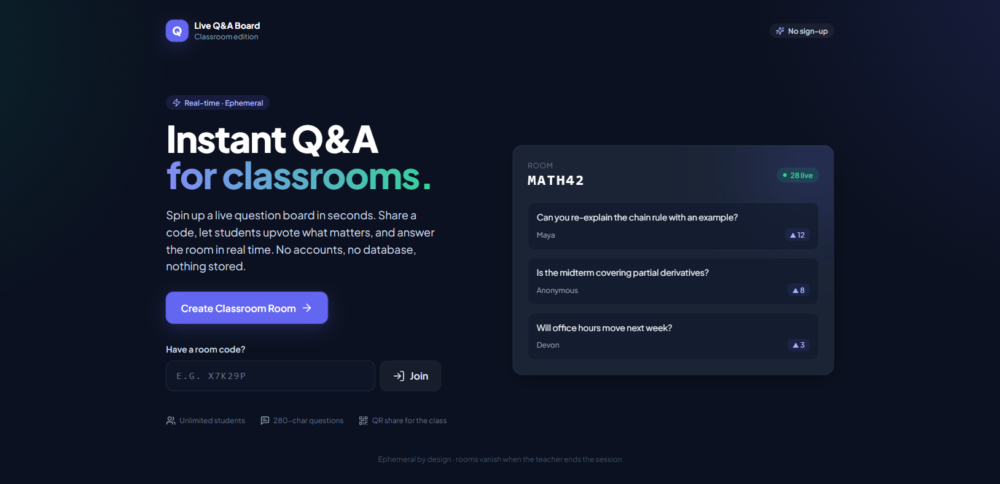
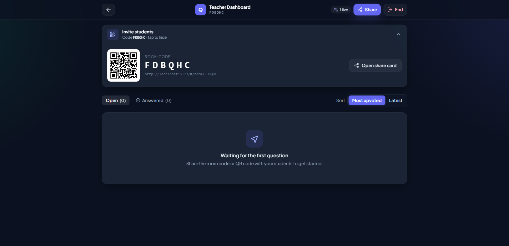
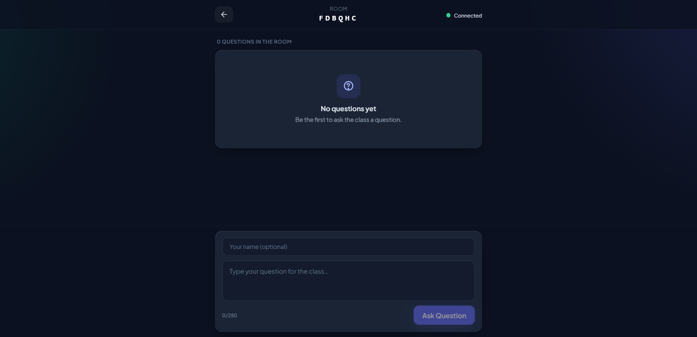

# Live Q&A Classroom Board

A real-time, ephemeral Q&A board built for classrooms. Spin up a live question room in seconds, share a code with students, and let the class upvote the questions that matter most.

## Preview

### Landing Page


### Teacher Dashboard


### Student View


## Features

- Create or join a room with a simple code
- Real-time sync across browser tabs
- Students can upvote questions
- Teacher can mark questions as answered or delete them
- QR code sharing for easy student access
- No accounts, no database, no stored data

## Getting Started

### Prerequisites

- Node.js >= 18
- npm

### Installation

```bash
npm install
npm run dev
```

Then open `http://localhost:5173` in your browser.

## Docker

Run the app with Docker for a consistent environment without worrying about Node versions or dependencies.

```bash
docker compose up --build
```

Then open `http://localhost:5173` in your browser.

To stop:

```bash
docker compose down
```

## Tech Stack

- React 18
- Vite 5
- Tailwind CSS
- Framer Motion
- Lucide React Icons
- QRCode React
- Canvas Confetti
