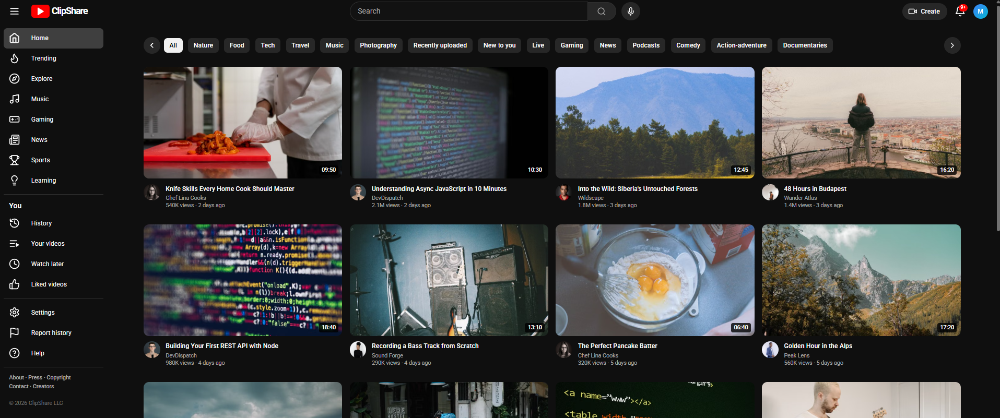

# ClipShare

A customizable video-sharing web app built with **Vite + React + TypeScript + Tailwind CSS**, backed by **Supabase** for data storage.

## Features

- **Browse videos** by category with live filtering
- **Watch videos** with a custom player (play/pause, seek, volume, fullscreen)
- **Search** videos by title or description
- **Trending page** showing most-viewed videos
- **Channel pages** with banner, avatar, subscriber count, and video grid
- **Comments** system — add and like comments
- **Responsive layout** with collapsible sidebar and mobile navigation
- **Dark theme** UI with a modern aesthetic

## Preview




## Tech Stack

| Layer | Technology |
|---|---|
| Frontend | React 18, TypeScript, Vite |
| Styling | Tailwind CSS 3 |
| Backend | Supabase (Postgres, RLS, Auth) |
| Icons | Lucide React |

## Getting Started

### Prerequisites

- Node.js 18 or later
- A Supabase project (create one at supabase.com)

### Setup

1. **Clone the repo**

```bash
git clone <your-repo-url>
cd clipshare
```

2. **Install dependencies**

```bash
npm install
```

3. **Configure environment**

```bash
cp .env.example .env
```

Then fill in your Supabase URL and anon key in the `.env` file.

4. **Set up Supabase tables**

Run the migration in `supabase/migrations/` against your Supabase project. It creates three tables — `channels`, `videos`, and `comments` — with row-level security (RLS) policies.

5. **Run the development server**

```bash
npm run dev
```

Open http://localhost:5173 to view the app.

6. **Build for production**

```bash
npm run build
```

## Running with Docker

The project can be built and run entirely via Docker. No Node.js or other tooling is required on your machine.

### Quick Start

```bash
docker compose up --build
```

The app will be available at http://localhost:3000.

### Docker Commands

| Command | Description |
|---|---|
| docker compose up --build | Build and start the app |
| docker compose down | Stop and remove containers |
| npm run docker:build | Build the Docker image |
| npm run docker:run | Run the Docker container |
| npm run docker:up | Same as docker compose up --build |
| npm run docker:down | Same as docker compose down |

### Environment Variables

Create a `.env` file from the template before running with Docker:

```bash
cp .env.example .env
```

Then fill in your Supabase URL and anon key.

## Project Structure

```
clipshare/
+-- src/
|   +-- components/   UI components (Header, Sidebar, VideoCard, etc.)
|   +-- pages/        Route pages (HomePage, WatchPage, etc.)
|   +-- lib/          Utilities (router, hooks, format, supabase, types)
|   +-- App.tsx       Main app with router provider
|   +-- main.tsx      Entry point
|   +-- index.css     Global styles + Tailwind imports
+-- supabase/
|   +-- migrations/   Database migrations
+-- public/           Static assets
+-- index.html        HTML entry point
+-- vite.config.ts    Vite configuration
+-- tailwind.config.js Tailwind CSS configuration
+-- tsconfig.json     TypeScript configuration
+-- .env.example      Environment template
+-- .gitignore        Git ignore rules
+-- Dockerfile        Docker build configuration
+-- docker-compose.yml Docker Compose orchestration
+-- nginx.conf        Nginx server configuration
+-- package.json      Project metadata and scripts
```

## Scripts

| Command | Description |
|---|---|
| npm run dev | Start development server |
| npm run build | Build for production |
| npm run preview | Preview production build locally |
| npm run lint | Run ESLint |
| npm run typecheck | Run TypeScript type checking |
| npm run docker:build | Build the Docker image |
| npm run docker:run | Run the Docker container |
| npm run docker:up | Build and start with Docker Compose |
| npm run docker:down | Stop and remove Docker containers |

## License

This project is open source and available for personal and commercial use.
