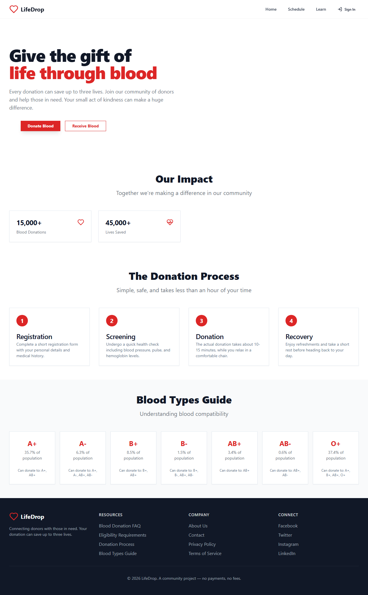

# Blood Management System


Blood Management System is a comprehensive web platform that connects blood donors with patients, families, caregivers, NGOs, and hospitals. The system streamlines the entire blood donation lifecycle — from donor registration and medical screening to appointment scheduling and real-time donor-recipient matching.

Built with React, TypeScript, Vite, Tailwind CSS, and Supabase.

---

## Table of Contents

- [Screenshots](#screenshots)
- [Features](#features)
- [Getting Started](#getting-started)
  - [Prerequisites](#prerequisites)
  - [Installation](#installation)
  - [Running the App](#running-the-app)
- [Docker Setup](#docker-setup)
- [Tech Stack](#tech-stack)
- [Project Structure](#project-structure)
- [How It Works](#how-it-works)
- [Environment Variables](#environment-variables)
- [Contributing](#contributing)
- [License](#license)

---

## Screenshots

### Home Page


### Authentication


### Donation Schedule


### Learn Page


---

## Features

### For Donors

- **Easy Registration** — Sign up with email and create your donor profile in seconds.
- **Donation Scheduling** — Book appointments at nearby donation centers with date and time selection.
- **Eligibility Check** — Interactive questionnaire to verify donation eligibility before booking.
- **Donation Tracking** — View your donation history and track your impact over time.
- **Achievements & Badges** — Earn badges and track milestones for repeat donations.

### For Recipients

- **Find Blood Donors** — Search for compatible blood donors by location and blood type.
- **Real-time Matching** — Get matched with eligible donors in your area instantly.
- **Direct Contact** — View donor contact details to coordinate pickup or delivery.

### Platform Features

- **Role-based Access** — Separate workflows for donors, receivers, and administrators.
- **Blood Type Compatibility** — Built-in guide showing which blood types can donate to or receive from each other.
- **Responsive Design** — Fully optimized for desktop, tablet, and mobile devices.
- **Dark / Light Theme** — Toggle between themes with persistent preference.
- **Notifications** — Real-time alerts for appointment reminders and urgent blood requests.

---

## Getting Started

### Prerequisites

- **Node.js** >= 18
- **npm** >= 9

### Installation

Clone the repository and install dependencies:

```bash
git clone https://github.com/yourusername/blood-management-system.git
cd blood-management-system
npm install
```

### Running the App

Start the development server:

```bash
npm run dev
```

Open your browser and navigate to `http://localhost:5173`.

---

## Docker Setup

Run Blood Management System with Docker for a consistent, isolated environment.

### Build and Run

```bash
docker compose up --build
```

The app will be available at `http://localhost:5173`.

### Stop the App

```bash
docker compose down
```

### Production Build

The Docker setup uses a multi-stage build:
1. **Builder stage** — Uses `node:20-alpine` to install dependencies and build the Vite production bundle.
2. **Production stage** — Uses `nginx:alpine` to serve the built assets with optimized caching and gzip compression.

---

## Tech Stack

| Technology | Purpose |
|------------|---------|
| **React 18** | UI library for building component-based interfaces |
| **TypeScript** | Type-safe JavaScript for better developer experience |
| **Vite 5** | Fast build tool and development server |
| **Tailwind CSS 4** | Utility-first CSS framework for rapid styling |
| **Supabase** | Backend, authentication, and database |
| **Lucide React** | Beautiful, consistent icon set |
| **Framer Motion** | Animation library for smooth transitions |
| **React Router** | Client-side routing |
| **TanStack Query** | Data fetching and caching |
| **Sonner** | Toast notifications |
| **React Hook Form + Zod** | Form handling and validation |

---

## Project Structure

```
blood-management-system/
├── public/
├── src/
│   ├── components/
│   │   ├── ui/               # shadcn/ui components
│   │   ├── Navbar.tsx
│   │   ├── Footer.tsx
│   │   ├── Hero.tsx
│   │   ├── DonationStats.tsx
│   │   ├── DonationProcess.tsx
│   │   ├── BloodTypeInfo.tsx
│   │   ├── DonorSection.tsx
│   │   ├── ReceiverSection.tsx
│   │   ├── AppointmentForm.tsx
│   │   ├── AppointmentList.tsx
│   │   ├── EligibilityCheck.tsx
│   │   └── use-toast.ts
│   ├── pages/
│   │   ├── Auth.tsx
│   │   ├── Index.tsx
│   │   ├── Centers.tsx
│   │   ├── Schedule.tsx
│   │   ├── Learn.tsx
│   │   └── Profile.tsx
│   ├── hooks/
│   │   └── useAuth.ts
│   ├── integrations/
│   │   └── supabase/
│   │       └── client.ts
│   ├── lib/
│   │   ├── queries.ts
│   │   └── utils.ts
│   ├── App.tsx
│   ├── main.tsx
│   └── index.css
├── index.html
├── package.json
├── vite.config.ts
├── tsconfig.json
├── Dockerfile
├── docker-compose.yml
├── .dockerignore
├── .gitignore
└── README.md
```

---

## How It Works

1. **Browse** — Explore the homepage to learn about blood donation, view impact stats, and understand the donation process.
2. **Donate** — Register as a donor with your details and blood group, then schedule an appointment at a nearby center.
3. **Receive** — Search for compatible blood donors in your area by entering your location.
4. **Learn** — Access educational resources including FAQs, blood type compatibility charts, eligibility requirements, and impact stories.
5. **Manage** — Track your appointments, view donation history, and manage your profile from the dashboard.

---

## Environment Variables

The app requires Supabase credentials. Create a `.env` file in the root:

```env
VITE_SUPABASE_URL=your-project-url
VITE_SUPABASE_ANON_KEY=your-anon-key
```

> **Note:** `.env` is ignored by git. Never commit real credentials.

---

## Contributing

Contributions are welcome! Please follow these steps:

1. Fork the repository
2. Create a feature branch (`git checkout -b feature/amazing-feature`)
3. Commit your changes (`git commit -m 'Add some amazing feature'`)
4. Push to the branch (`git push origin feature/amazing-feature`)
5. Open a Pull Request

---

## License

This project is open source and available under the MIT License.

---

Built with care by the LifeDrop team. Happy donating!
