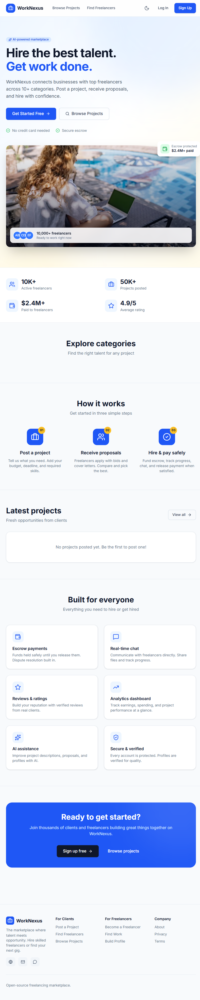
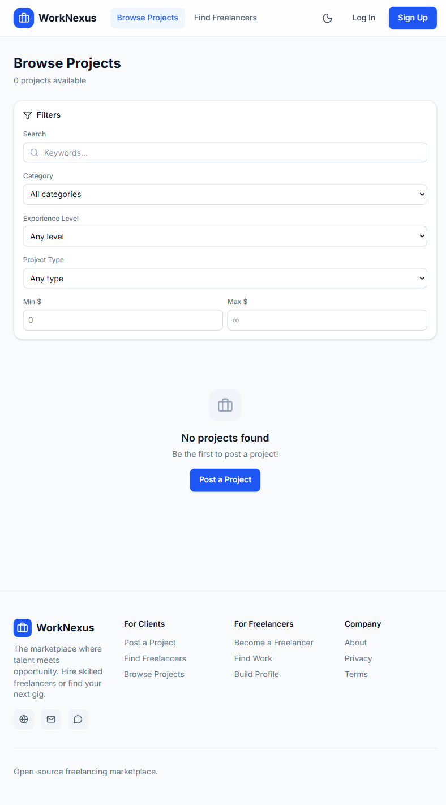
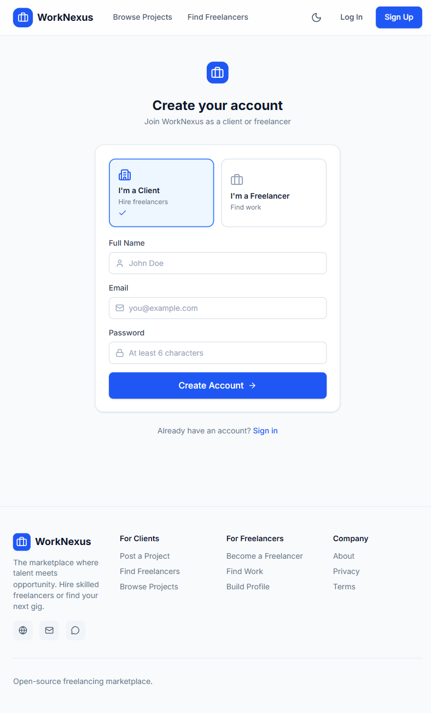

# WorkNexus — Freelancing Marketplace


WorkNexus is a modern freelancing marketplace where clients post projects and freelancers bid, collaborate, and get work done. Built with React, TypeScript, Vite, Tailwind CSS, and Supabase.

---

## Table of Contents

- [Screenshots](#screenshots)
- [Features](#features)
- [Getting Started](#getting-started)
- [Docker Setup](#docker-setup)
- [Tech Stack](#tech-stack)
- [Project Structure](#project-structure)
- [Environment Variables](#environment-variables)
- [Contributing](#contributing)
- [License](#license)

---

## Screenshots

### Landing Page


### Browse Projects


### Sign Up


---

## Features

### For Clients

- **Post Projects** — Create detailed project listings with budget, timeline, and requirements
- **Browse Freelancers** — Find skilled freelancers across 10+ categories
- **Receive Proposals** — Review and compare freelancer proposals
- **Manage Projects** — Track progress, communicate, and release payments

### For Freelancers

- **Find Work** — Browse and bid on projects matching your skills
- **Build Profile** — Showcase your portfolio, skills, and experience
- **Send Proposals** — Submit competitive bids with cover letters
- **Track Earnings** — Monitor income and job history

### Platform Features

- **Role-based Access** — Client, freelancer, and admin roles
- **Real-time Messaging** — Built-in chat system
- **Notifications** — Real-time alerts for proposals, messages, and updates
- **Dark / Light Theme** — Toggle between themes
- **Responsive Design** — Works on desktop, tablet, and mobile

---

## Getting Started

### Prerequisites

- **Node.js** >= 18
- **npm** >= 9

### Installation

```bash
git clone https://github.com/yourusername/worknexus.git
cd worknexus
npm install
```

### Running the App

```bash
npm run dev
```

Open `http://localhost:5173`.

---

## Docker Setup

```bash
docker compose up --build
```

Opens on `http://localhost:5173`.

```bash
docker compose down
```

---

## Tech Stack

| Technology | Purpose |
|------------|---------|
| **React 19** | UI library |
| **TypeScript** | Type safety |
| **Vite 8** | Build tool |
| **Tailwind CSS 4** | Styling |
| **Supabase** | Backend & auth |
| **React Router 7** | Routing |

---

## Project Structure

```
worknexus/
├── src/
│   ├── components/
│   ├── pages/
│   ├── lib/
│   ├── App.tsx
│   ├── main.tsx
│   └── index.css
├── index.html
├── package.json
├── vite.config.ts
├── tailwind.config.js
├── postcss.config.js
├── tsconfig.json
├── Dockerfile
├── docker-compose.yml
├── .dockerignore
├── .gitignore
├── .env
└── README.md
```

---

## Environment Variables

```env
VITE_SUPABASE_URL=your-project-url
VITE_SUPABASE_ANON_KEY=your-anon-key
```

> `.env` is ignored by git.

---

## Contributing

1. Fork the repo
2. Create a feature branch
3. Commit your changes
4. Push to the branch
5. Open a Pull Request

---

## License

MIT
