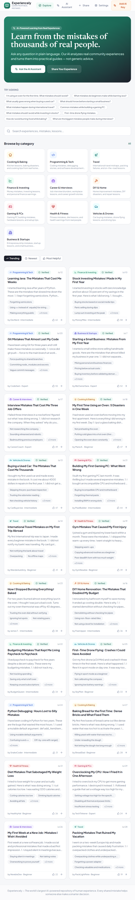
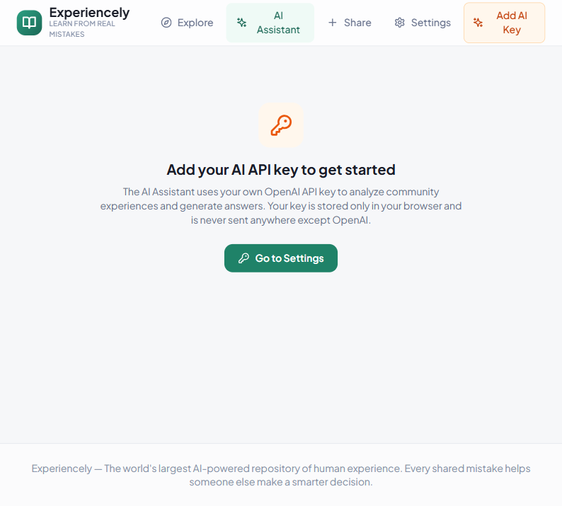
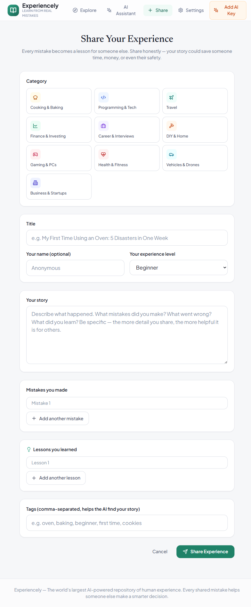

# Experiencely — Learn From Real Mistakes


Experiencely is an AI-powered community where people share real experiences and mistakes. Ask questions in natural language and get answers grounded in thousands of real stories.

Built with React, TypeScript, Vite, Tailwind CSS, and Supabase.

---

## Table of Contents

- [Screenshots](#screenshots)
- [Features](#features)
- [Getting Started](#getting-started)
- [Docker Setup](#docker-setup)
- [Tech Stack](#tech-stack)
- [Project Structure](#project-structure)
- [How It Works](#how-it-works)
- [Environment Variables](#environment-variables)
- [Contributing](#contributing)
- [License](#license)

---

## Screenshots

### Home / Explore Page


### AI Assistant


### Share Experience


---

## Features

### Explore & Learn

- **Browse Experiences** — Discover real mistakes and lessons across categories
- **Search & Filter** — Find experiences by keyword, category, or topic
- **Trending & Recent** — See what's popular and what's new
- **Detailed Posts** — Read full stories with mistakes, lessons, and tips

### AI Assistant

- **Natural Language Queries** — Ask questions like "What mistakes should I avoid when buying a used car?"
- **Grounded Answers** — AI responses based on real community experiences
- **Structured Insights** — Common mistakes, why they happen, how to avoid them, community tips
- **Recommended Posts** — Links to relevant experiences

### Share & Contribute

- **Share Experiences** — Post your own mistakes and lessons learned
- **Category Selection** — Choose from multiple categories
- **Structured Format** — Share mistakes, lessons, and tips in a structured way
- **Community Impact** — Help others make smarter decisions

### Platform Features

- **Dark / Light Theme** — Toggle between themes with persistent preference
- **Responsive Design** — Fully optimized for desktop, tablet, and mobile
- **Learning Modes** — Beginner, intermediate, and expert modes
- **Trust Indicators** — Verified posts, helpful counts, and community validation

---

## Getting Started

### Prerequisites

- **Node.js** >= 18
- **npm** >= 9

### Installation

Clone the repository and install dependencies:

```bash
git clone https://github.com/yourusername/experiencely.git
cd experiencely
npm install
```

### Running the App

Start the development server:

```bash
npm run dev
```

Open your browser and navigate to `http://localhost:5173`.

---

## Docker Setup

Run Experiencely with Docker for a consistent, isolated environment.

### Build and Run

```bash
docker compose up --build
```

The app will be available at `http://localhost:5173`.

### Stop the App

```bash
docker compose down
```

### Production Build

The Docker setup uses a multi-stage build:
1. **Builder stage** — Uses `node:20-alpine` to install dependencies and build the Vite production bundle.
2. **Production stage** — Uses `nginx:alpine` to serve the built assets with optimized caching and gzip compression.

---

## Tech Stack

| Technology | Purpose |
|------------|---------|
| **React 18** | UI library for building component-based interfaces |
| **TypeScript** | Type-safe JavaScript for better developer experience |
| **Vite 5** | Fast build tool and development server |
| **Tailwind CSS** | Utility-first CSS framework for rapid styling |
| **Supabase** | Backend, authentication, and database |
| **Lucide React** | Beautiful, consistent icon set |

---

## Project Structure

```
experiencely/
├── public/
├── src/
│   ├── components/
│   │   └── ...
│   ├── pages/
│   │   ├── ExplorePage.tsx
│   │   ├── AssistantPage.tsx
│   │   ├── PostDetailPage.tsx
│   │   ├── SharePage.tsx
│   │   └── SettingsPage.tsx
│   ├── lib/
│   │   ├── supabase.ts
│   │   ├── types.ts
│   │   ├── ai.ts
│   │   ├── storage.ts
│   │   └── categoryStyles.ts
│   ├── App.tsx
│   ├── main.tsx
│   └── index.css
├── index.html
├── package.json
├── vite.config.ts
├── tailwind.config.js
├── postcss.config.js
├── tsconfig.json
├── Dockerfile
├── docker-compose.yml
├── .dockerignore
├── .gitignore
├── .env
└── README.md
```

---

## How It Works

1. **Explore** — Browse real experiences shared by the community across various categories
2. **Search** — Find specific experiences using natural language search
3. **Ask AI** — Query the AI assistant to get structured insights from community wisdom
4. **Share** — Contribute your own experiences and lessons learned
5. **Learn** — Apply insights to make smarter decisions in life, work, and learning

---

## Environment Variables

The app requires Supabase credentials. Create a `.env` file in the root:

```env
VITE_SUPABASE_URL=your-project-url
VITE_SUPABASE_ANON_KEY=your-anon-key
```

> **Note:** `.env` is ignored by git. Never commit real credentials.

---

## Contributing

Contributions are welcome! Please follow these steps:

1. Fork the repository
2. Create a feature branch (`git checkout -b feature/amazing-feature`)
3. Commit your changes (`git commit -m 'Add some amazing feature'`)
4. Push to the branch (`git push origin feature/amazing-feature`)
5. Open a Pull Request

---

## License

This project is open source and available under the MIT License.

---

Built with care by the Experiencely team. Happy learning!
