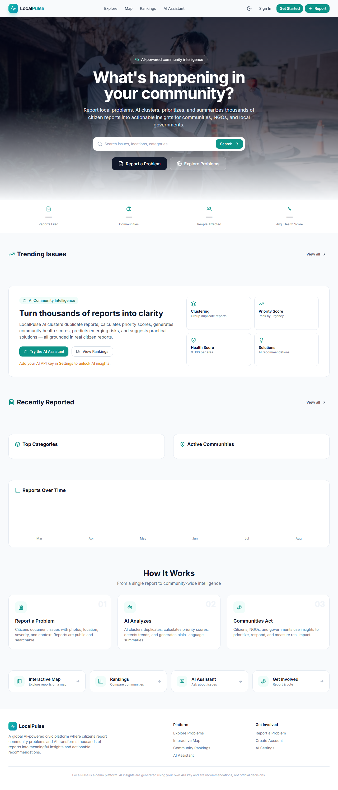
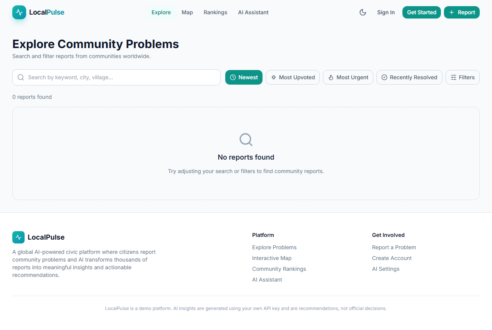
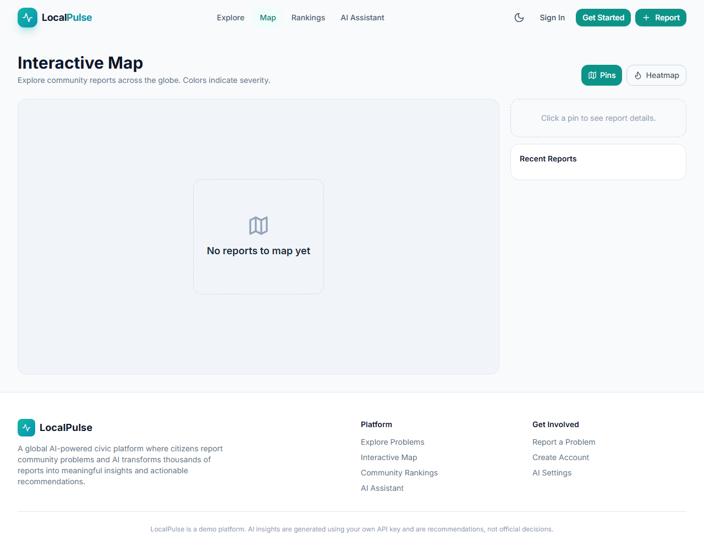

# LocalPulse — AI-Powered Community Problem Reporting


LocalPulse is an AI-powered civic platform where citizens report local community problems and AI transforms thousands of reports into meaningful insights and actionable recommendations for communities, NGOs, and local governments.

Built with React, TypeScript, Vite, Tailwind CSS, and Supabase.

---

## Table of Contents

- [Screenshots](#screenshots)
- [Features](#features)
- [Getting Started](#getting-started)
- [Docker Setup](#docker-setup)
- [Tech Stack](#tech-stack)
- [Project Structure](#project-structure)
- [How It Works](#how-it-works)
- [Environment Variables](#environment-variables)
- [Contributing](#contributing)
- [License](#license)

---

## Screenshots

### Home Page


### Explore Page


### Map Page


---

## Features

### For Citizens

- **Report Problems** — Document local issues with photos, location, severity, and category
- **Search & Explore** — Find reports by keyword, location, category, or status
- **Interactive Map** — View all reports geographically
- **Vote & Comment** — Upvote important issues and discuss with the community
- **Track Progress** — Follow reports from "Reported" to "Resolved"

### For Communities & NGOs

- **AI-Powered Insights** — Automatic clustering of duplicate reports, priority scoring, and trend detection
- **Community Health Scores** — 0-100 health scores for each area across 19 dimensions
- **Rankings** — Compare cities, categories, and severity levels
- **AI Assistant** — Chat with AI to ask questions about community issues
- **Dashboard** — Manage reports, track impact, and export data

### Platform Features

- **Dark / Light Theme** — Toggle between themes with persistent preference
- **Responsive Design** — Fully optimized for desktop, tablet, and mobile
- **Real-time Updates** — Live updates via Supabase subscriptions
- **Role-based Access** — Citizen, NGO, Government, and Admin roles
- **Global Reach** — Available worldwide with multi-country, state, and city support

---

## Getting Started

### Prerequisites

- **Node.js** >= 18
- **npm** >= 9

### Installation

Clone the repository and install dependencies:

```bash
git clone https://github.com/yourusername/localpulse.git
cd localpulse
npm install
```

### Running the App

Start the development server:

```bash
npm run dev
```

Open your browser and navigate to `http://localhost:5173`.

---

## Docker Setup

Run LocalPulse with Docker for a consistent, isolated environment.

### Build and Run

```bash
docker compose up --build
```

The app will be available at `http://localhost:5173`.

### Stop the App

```bash
docker compose down
```

### Production Build

The Docker setup uses a multi-stage build:
1. **Builder stage** — Uses `node:20-alpine` to install dependencies and build the Vite production bundle.
2. **Production stage** — Uses `nginx:alpine` to serve the built assets with optimized caching and gzip compression.

---

## Tech Stack

| Technology | Purpose |
|------------|---------|
| **React 18** | UI library for building component-based interfaces |
| **TypeScript** | Type-safe JavaScript for better developer experience |
| **Vite 5** | Fast build tool and development server |
| **Tailwind CSS** | Utility-first CSS framework for rapid styling |
| **Supabase** | Backend, authentication, and database |
| **Lucide React** | Beautiful, consistent icon set |
| **TanStack Query** | Data fetching and caching |
| **Sonner** | Toast notifications |

---

## Project Structure

```
localpulse/
├── public/
├── src/
│   ├── components/
│   │   ├── ui.tsx           # Reusable UI components
│   │   ├── Layout.tsx       # Header and Footer
│   │   └── ReportCard.tsx   # Report card component
│   ├── pages/
│   │   ├── HomePage.tsx
│   │   ├── ExplorePage.tsx
│   │   ├── MapPage.tsx
│   │   ├── ReportFormPage.tsx
│   │   ├── ReportDetailPage.tsx
│   │   ├── RankingsPage.tsx
│   │   ├── CommunityPage.tsx
│   │   ├── ChatPage.tsx
│   │   ├── SettingsPage.tsx
│   │   ├── DashboardPage.tsx
│   │   └── AuthPage.tsx
│   ├── context/
│   │   ├── AuthContext.tsx
│   │   ├── ThemeContext.tsx
│   │   └── ToastContext.tsx
│   ├── lib/
│   │   ├── supabase.ts
│   │   ├── router.ts
│   │   ├── constants.ts
│   │   ├── analytics.ts
│   │   ├── ai.ts
│   │   └── types-extra.ts
│   ├── types.ts
│   ├── App.tsx
│   ├── main.tsx
│   └── index.css
├── index.html
├── package.json
├── vite.config.ts
├── tailwind.config.js
├── postcss.config.js
├── tsconfig.json
├── Dockerfile
├── docker-compose.yml
├── .dockerignore
├── .gitignore
├── .env
└── README.md
```

---

## How It Works

1. **Report** — Citizens document local issues with photos, location, severity, and category
2. **Explore** — Browse reports on an interactive map or search by keyword, location, or category
3. **AI Analysis** — AI clusters duplicates, calculates priority scores, detects trends, and generates summaries
4. **Community Action** — Citizens, NGOs, and governments use insights to prioritize, respond, and measure impact
5. **Track Impact** — Monitor progress from report to resolution with community health scores

---

## Environment Variables

The app requires Supabase credentials. Create a `.env` file in the root:

```env
VITE_SUPABASE_URL=your-project-url
VITE_SUPABASE_ANON_KEY=your-anon-key
```

> **Note:** `.env` is ignored by git. Never commit real credentials.

---

## Contributing

Contributions are welcome! Please follow these steps:

1. Fork the repository
2. Create a feature branch (`git checkout -b feature/amazing-feature`)
3. Commit your changes (`git commit -m 'Add some amazing feature'`)
4. Push to the branch (`git push origin feature/amazing-feature`)
5. Open a Pull Request

---

## License

This project is open source and available under the MIT License.

---

Built with care by the LocalPulse team. Happy reporting!
