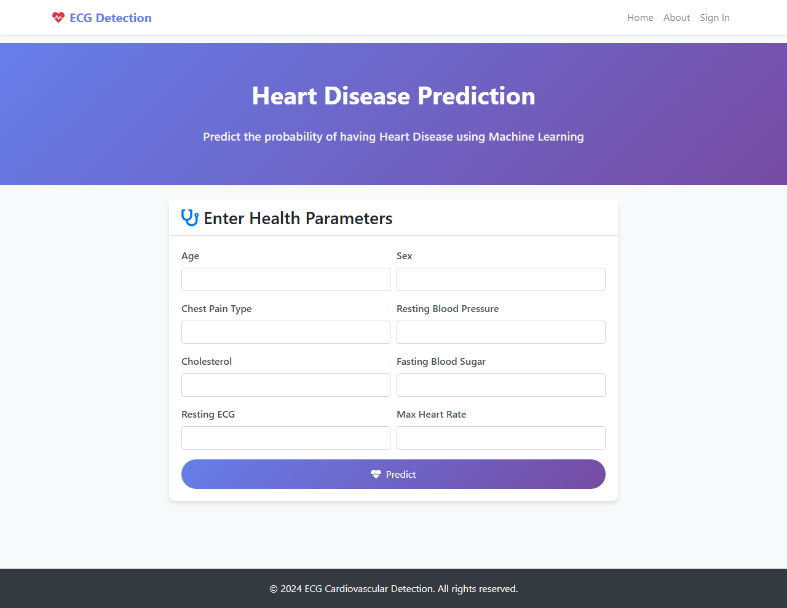
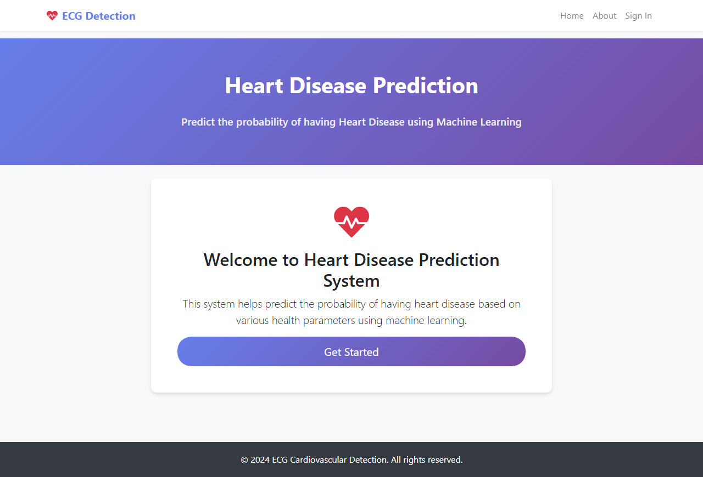
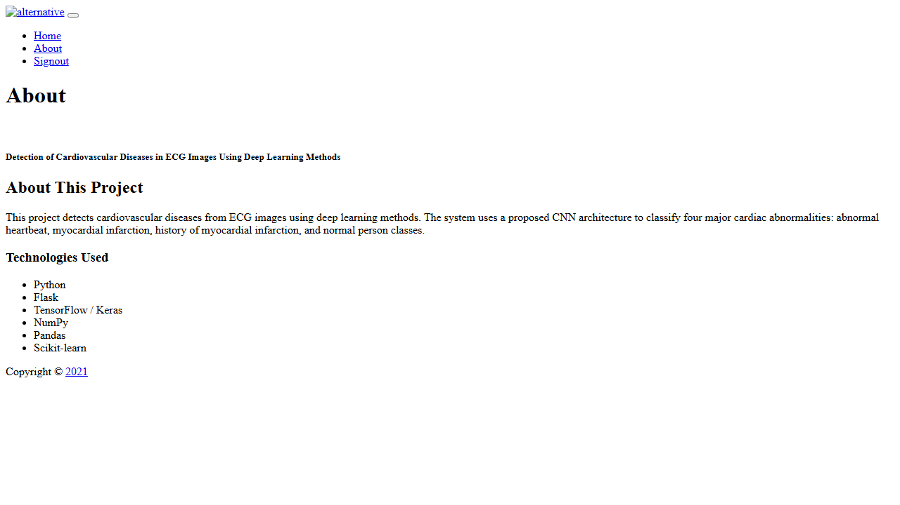

# Detection of Cardiovascular Diseases in ECG Images Using Deep Learning Methods


A deep learning-based system for detecting cardiovascular diseases from ECG images. This project includes both a **Flask web application** and a **Tkinter desktop application** for predicting heart disease using a proposed CNN architecture.

---

## Table of Contents

- [Screenshots](#screenshots)
- [Features](#features)
- [Getting Started](#getting-started)
- [Docker Setup](#docker-setup)
- [Tech Stack](#tech-stack)
- [Project Structure](#project-structure)
- [How It Works](#how-it-works)
- [Model Information](#model-information)
- [Contributing](#contributing)
- [License](#license)

---

## Screenshots

### Web Application - Home Page


### Web Application - Prediction Result


### Desktop Application


---

## Features

### Web Application (Flask)

- **User Authentication** — Sign up and sign in functionality
- **Heart Disease Prediction** — Predict the probability of heart disease based on health parameters
- **User-friendly Interface** — Clean and responsive web interface
- **SQLite Database** — Stores user registration information

### Desktop Application (Tkinter + Keras)

- **ECG Image Upload** — Select and upload ECG images for prediction
- **Deep Learning Prediction** — Uses trained CNN model to classify cardiac abnormalities
- **Real-time Results** — Instant prediction with confidence scores
- **Graphical Interface** — Easy-to-use desktop application

### Model Capabilities

- Detects four major cardiac abnormalities:
  - Abnormal heartbeat
  - Myocardial infarction
  - History of myocardial infarction
  - Normal person
- Uses transfer learning with SqueezeNet and AlexNet
- Proposed lightweight CNN architecture for improved accuracy

---

## Getting Started

### Prerequisites

- **Python** >= 3.8
- **pip** package manager

### Installation

1. Clone the repository:
```bash
git clone https://github.com/yourusername/ecg-cardiovascular-detection.git
cd ecg-cardiovascular-detection
```

2. Install dependencies:
```bash
pip install -r requirements.txt
```

3. Download the pre-trained model:
   - Place `keras_model.h5` in the root directory
   - Place `labels.txt` in the root directory
   - Place `model.sav` in the root directory (for web app)

4. Run the Flask web application:
```bash
python app.py
```

5. Open your browser and navigate to `http://localhost:5000`

6. Run the desktop application (optional):
```bash
python desktop-app/ecg_prediction.py
```

---

## Docker Setup

Run the application with Docker for a consistent environment.

### Build and Run

```bash
docker compose up --build
```

The web application will be available at `http://localhost:5000`.

### Stop the App

```bash
docker compose down
```

---

## Tech Stack

| Technology | Purpose |
|------------|---------|
| **Python** | Programming language |
| **Flask** | Web framework for web application |
| **TensorFlow** | Deep learning framework |
| **Keras** | Neural network API |
| **NumPy** | Numerical computing |
| **Pandas** | Data manipulation |
| **Tkinter** | Desktop GUI framework |
| **Pillow** | Image processing |
| **SQLite** | Database for user information |

---

## Project Structure

```
ecg-cardiovascular-detection/
├── app.py                      # Flask web application
├── model.sav                   # Trained ML model for web app
├── keras_model.h5              # Trained CNN model for desktop app
├── labels.txt                  # Class labels for prediction
├── requirements.txt            # Python dependencies
├── Dockerfile                  # Docker configuration
├── docker-compose.yml          # Docker Compose configuration
├── .dockerignore               # Docker ignore file
├── .gitignore                  # Git ignore file
├── README.md                   # Project documentation
├── templates/                  # Flask HTML templates
│   ├── home.html
│   ├── signup.html
│   ├── signin.html
│   ├── result.html
│   ├── index.html
│   └── about.html
├── static/                     # Static assets
│   ├── css/
│   ├── js/
│   └── images/
└── desktop-app/                # Desktop application
    └── ecg_prediction.py
```

---

## How It Works

### Web Application Flow

1. **User Registration** — New users sign up with username, email, and password
2. **User Login** — Existing users sign in to access the prediction system
3. **Input Parameters** — Users enter health parameters (age, sex, chest pain type, blood pressure, cholesterol, etc.)
4. **Prediction** — The trained ML model predicts the probability of heart disease
5. **Results** — Users see the prediction result with probability percentage

### Desktop Application Flow

1. **Load Model** — The pre-trained CNN model is loaded
2. **Select Image** — User selects an ECG image file
3. **Preprocess** — Image is resized and normalized
4. **Predict** — Model classifies the ECG image
5. **Display Result** — Shows the predicted class and confidence score

---

## Model Information

### Proposed CNN Architecture

The project proposes a new lightweight CNN architecture for cardiovascular disease prediction from ECG images. The model achieves better accuracy compared to existing methods using transfer learning approaches with SqueezeNet and AlexNet.

### Performance

- **Dataset**: Public ECG images dataset of cardiac patients
- **Classes**: 4 major cardiac abnormalities
- **Approach**: Transfer learning + Proposed CNN
- **Result**: Outperforms existing works in accuracy metrics

---

## Contributing

Contributions are welcome! Please follow these steps:

1. Fork the repository
2. Create a feature branch (`git checkout -b feature/amazing-feature`)
3. Commit your changes (`git commit -m 'Add some amazing feature'`)
4. Push to the branch (`git push origin feature/amazing-feature`)
5. Open a Pull Request

---

## License

This project is open source and available under the MIT License.

---

Built with care by the ECG Detection team. Happy coding!
