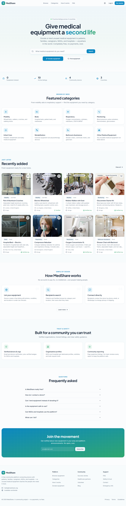
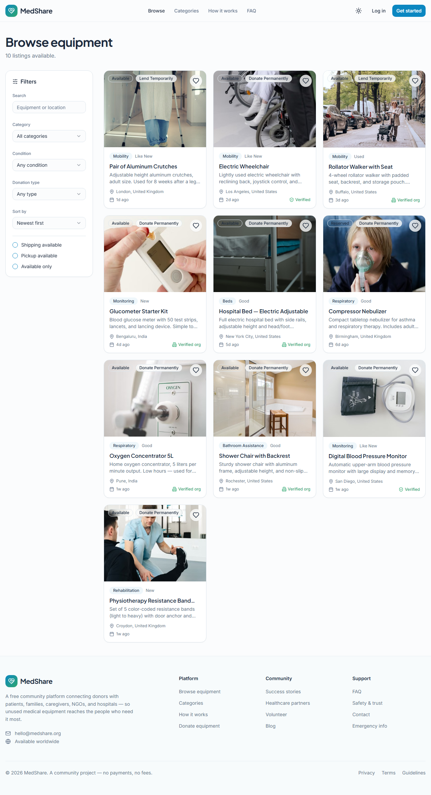
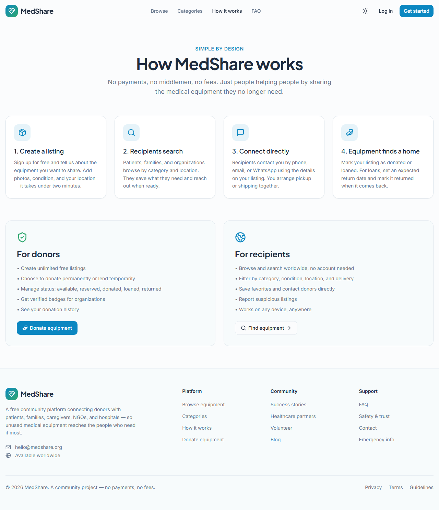

# MedShare — Donate & Lend Medical Equipment


MedShare is a free community platform that connects donors with patients, families, caregivers, NGOs, and hospitals. Donate or lend unused medical equipment — wheelchairs, hospital beds, oxygen concentrators, walkers, glucometers, and more — to people who need it most.

Built with Next.js 13, TypeScript, Tailwind CSS, Supabase, and shadcn/ui.

---

## Screenshots

### Home Page


### Browse Page


### How It Works


---

## Table of Contents

- [Features](#features)
- [Getting Started](#getting-started)
  - [Prerequisites](#prerequisites)
  - [Installation](#installation)
  - [Running the App](#running-the-app)
- [Docker Setup](#docker-setup)
- [Tech Stack](#tech-stack)
- [Project Structure](#project-structure)
- [How It Works](#how-it-works)
- [Environment Variables](#environment-variables)
- [Contributing](#contributing)
- [License](#license)

---

## Features

### For Donors

- **List Equipment** — Create free listings with photos, condition, location, and contact details in under two minutes.
- **Donate or Lend** — Choose to give equipment permanently or lend it temporarily with an expected return date.
- **Verified Profiles** — Build trust with email/phone verification and verified badges for NGOs and hospitals.
- **Organization Accounts** — NGOs and hospitals get dedicated profiles, wishlists, and bulk request tools.
- **Direct Communication** — Recipients contact you directly via phone, email, or WhatsApp.

### For Recipients

- **Browse Equipment** — Search thousands of listings by category, location, condition, and availability.
- **Smart Filters** — Filter by category, condition, donation type, country, city, shipping, and pickup options.
- **Save Favorites** — Keep track of equipment you need with a wishlist.
- **Contact Donors** — View donor contact details and reach out directly to arrange pickup or shipping.
- **No Fees** — Completely free platform. No payments, no middlemen, no charges.

### Platform Features

- **Global Reach** — Available worldwide. Anyone can create a listing or search for equipment.
- **Community Safety** — Verified donors, honest listings, and community reporting tools.
- **Responsive Design** — Optimized for desktop, tablet, and mobile.
- **Dark / Light Theme** — Toggle between themes with persistent preference.

---

## Getting Started

### Prerequisites

- **Node.js** >= 18
- **npm** >= 9

### Installation

```bash
git clone https://github.com/yourusername/medshare.git
cd medshare
npm install
```

### Running the App

Start the development server:

```bash
npm run dev
```

Open your browser and navigate to `http://localhost:3000`.

---

## Docker Setup

Run MedShare with Docker for a consistent, isolated environment.

### Build and Run

```bash
docker compose up --build
```

The app will be available at `http://localhost:3000`.

### Stop the App

```bash
docker compose down
```

### Production Build

The Docker setup uses a multi-stage build:
1. **Builder stage** — Uses `node:20-alpine` to install dependencies and build the Next.js production bundle.
2. **Production stage** — Uses `node:20-alpine` to run the production server on port 3000.

---

## Tech Stack

| Technology | Purpose |
|------------|---------|
| **Next.js 13** | React framework with App Router |
| **TypeScript** | Type-safe JavaScript |
| **Tailwind CSS** | Utility-first CSS framework |
| **shadcn/ui** | Reusable UI component library |
| **Supabase** | Backend, auth, and database |
| **Lucide React** | Icon library |
| **Framer Motion** | Animations |
| **Sonner** | Toast notifications |
| **React Hook Form + Zod** | Form handling and validation |

---

## Project Structure

```
medshare/
├── app/
│   ├── browse/
│   ├── categories/
│   ├── dashboard/
│   ├── faq/
│   ├── how-it-works/
│   ├── listings/
│   │   ├── [id]/
│   │   └── new/
│   ├── login/
│   ├── signup/
│   ├── globals.css
│   ├── layout.tsx
│   └── page.tsx
├── components/
│   ├── ui/               # shadcn/ui components
│   ├── auth-form.tsx
│   ├── auth-provider.tsx
│   ├── browse-filters.tsx
│   ├── favorite-button.tsx
│   ├── gallery.tsx
│   ├── home-search.tsx
│   ├── listing-card.tsx
│   ├── listing-form.tsx
│   ├── report-dialog.tsx
│   ├── site-footer.tsx
│   ├── site-header.tsx
│   └── theme-provider.tsx
├── hooks/
├── lib/
│   ├── constants.tsx
│   ├── format.ts
│   ├── queries.ts
│   ├── supabase.ts
│   └── utils.ts
├── supabase/
├── public/
├── .env
├── next.config.js
├── tailwind.config.ts
├── tsconfig.json
├── package.json
├── Dockerfile
├── docker-compose.yml
├── .dockerignore
├── .gitignore
└── README.md
```

---

## How It Works

1. **Browse** — Explore the homepage for recently added equipment, popular categories, and platform stats.
2. **Search & Filter** — Use the search bar and advanced filters to find exactly what you need.
3. **View Details** — Click any listing to see photos, condition, donor info, and contact options.
4. **Connect** — Contact the donor directly by phone, email, or WhatsApp to arrange pickup or shipping.
5. **List Equipment** — Sign up and create a free listing in minutes. Choose to donate or lend.
6. **Manage** — Track your listings, favorites, and profile from the dashboard.

---

## Environment Variables

The app requires Supabase credentials. Create a `.env` file in the root:

```env
NEXT_PUBLIC_SUPABASE_URL=your-project-url
NEXT_PUBLIC_SUPABASE_ANON_KEY=your-anon-key
```

> **Note:** `.env` is ignored by git. Never commit real credentials.

---

## Contributing

Contributions are welcome! Please follow these steps:

1. Fork the repository
2. Create a feature branch (`git checkout -b feature/amazing-feature`)
3. Commit your changes (`git commit -m 'Add some amazing feature'`)
4. Push to the branch (`git push origin feature/amazing-feature`)
5. Open a Pull Request

---

## License

This project is open source and available under the MIT License.

---

Built with care by the MedShare team. Happy donating!
