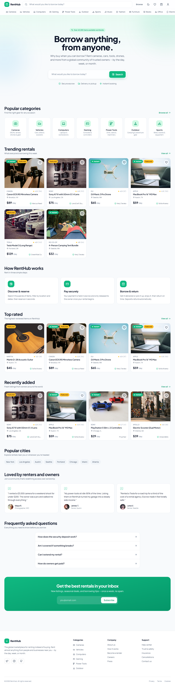
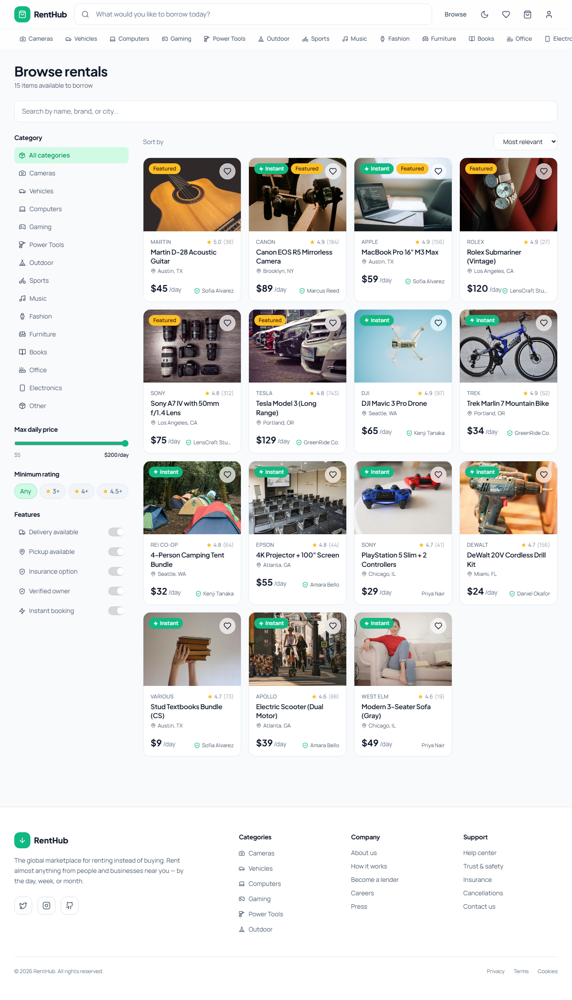
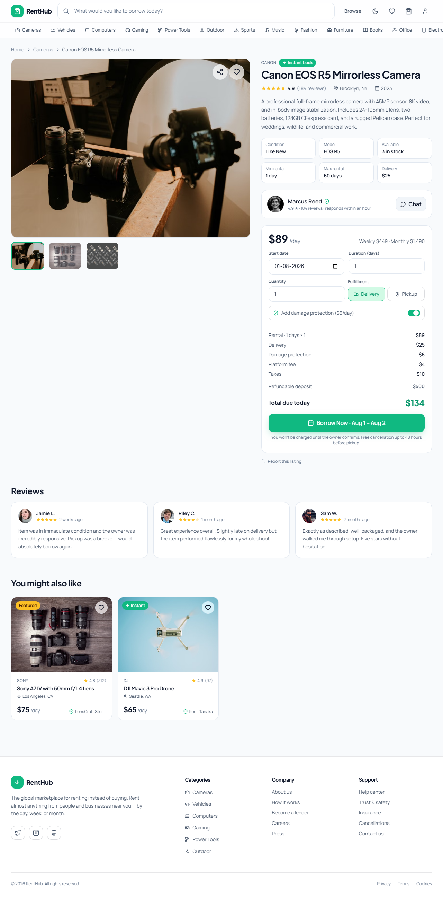

# RentHub — Rent Anything, From Anyone


RentHub is a modern, full-featured rental marketplace web application where users can discover, browse, and rent almost anything from people and businesses near them — from cameras and cars to tools, drones, gaming gear, and more. Built with React, TypeScript, and Tailwind CSS, it offers a smooth, responsive experience for both renters and owners.

Whether you need a DSLR camera for the weekend, a power drill for a home project, or a Tesla for a road trip, RentHub connects you with trusted local owners. No sign-up required to browse — just search, compare, and book in seconds.

---

## Table of Contents

- [Screenshots](#screenshots)
- [Features](#features)
- [Getting Started](#getting-started)
  - [Prerequisites](#prerequisites)
  - [Installation](#installation)
  - [Running the App](#running-the-app)
- [Docker Setup](#docker-setup)
- [Tech Stack](#tech-stack)
- [Project Structure](#project-structure)
- [How It Works](#how-it-works)
- [Contributing](#contributing)
- [License](#license)

---

## Screenshots

### Home Page


### Browse Page


### Listing Page


---

## Features

### For Renters

- **Discover & Browse** — Explore thousands of rental listings across 14+ categories including cameras, vehicles, computers, gaming, tools, outdoor gear, sports equipment, music instruments, fashion, furniture, books, office equipment, electronics, and more.
- **Smart Search & Filters** — Search by keyword, brand, model, or city. Filter results by price range, minimum rating, delivery availability, pickup options, insurance, verified owners, and instant booking.
- **Sorting Options** — Sort by relevance, newest, most popular, highest rated, lowest price, or highest price.
- **Detailed Listings** — View high-quality image galleries, full descriptions, specifications, owner profiles, reviews, and availability.
- **Pricing Calculator** — Calculate rental costs by day, week, or month with instant price breakdown including delivery, insurance, platform fees, and taxes.
- **Shopping Cart** — Add multiple items, adjust quantities and durations, and review your order before checkout.
- **Multi-Step Checkout** — Enter delivery details, choose payment method, and review your order with a clean, guided checkout flow.
- **Wishlist** — Save favorite listings for later with a single click.
- **Recently Viewed** — Keep track of listings you've browsed.
- **User Dashboard** — Manage active rentals, upcoming pickups, wishlist, payments, returns, and account settings.
- **Dark / Light Theme** — Toggle between dark and light modes with persistent preference.

### For Owners

- **List Your Items** — Share cameras, vehicles, tools, and more with a global community of renters.
- **Earn Income** — Turn idle assets into steady revenue by setting your own daily, weekly, and monthly rates.
- **Verified Status** — Build trust with verified owner badges and ratings.
- **Instant Booking** — Accept bookings instantly or review requests manually.
- **Insurance Options** — Offer damage protection for peace of mind.

### Platform Features

- **Secure Escrow** — Payments are held securely and only released to owners once the rental begins.
- **Free Cancellation** — Free cancellation up to 48 hours before pickup.
- **Refundable Deposits** — Deposits are held separately and automatically refunded on return.
- **Responsive Design** — Fully optimized for desktop, tablet, and mobile devices.
- **No Sign-Up Required** — Browse and search without creating an account (booking requires checkout details).

---

## Getting Started

### Prerequisites

- **Node.js** >= 18
- **npm** >= 9

### Installation

Clone the repository and install dependencies:

```bash
git clone https://github.com/yourusername/renthub.git
cd renthub
npm install
```

### Running the App

Start the development server:

```bash
npm run dev
```

Open your browser and navigate to `http://localhost:5173`.

---

## Docker Setup

Run RentHub with Docker for a consistent, isolated environment — no need to worry about Node versions or local dependency conflicts.

### Build and Run

```bash
docker compose up --build
```

The app will be available at `http://localhost:5173`.

### Stop the App

```bash
docker compose down
```

### Production Build

The Docker setup uses a multi-stage build:
1. **Builder stage** — Uses `node:20-alpine` to install dependencies and build the Vite production bundle.
2. **Production stage** — Uses `nginx:alpine` to serve the built assets with optimized caching and gzip compression.

---

## Tech Stack

| Technology | Purpose |
|------------|---------|
| **React 18** | UI library for building component-based interfaces |
| **TypeScript** | Type-safe JavaScript for better developer experience |
| **Vite 5** | Fast build tool and development server |
| **Tailwind CSS** | Utility-first CSS framework for rapid styling |
| **Lucide React** | Beautiful, consistent icon set |
| **Framer Motion** | Animation library for smooth transitions |

---

## Project Structure

```
renthub/
├── public/
├── src/
│   ├── components/       # Reusable UI components
│   │   ├── CategoryIcon.tsx
│   │   ├── Header.tsx
│   │   ├── Footer.tsx
│   │   ├── ListingCard.tsx
│   │   ├── ListingGrid.tsx
│   │   ├── StarRating.tsx
│   │   └── Toasts.tsx
│   ├── pages/            # Route-level page components
│   │   ├── HomePage.tsx
│   │   ├── BrowsePage.tsx
│   │   ├── ListingPage.tsx
│   │   ├── CartPage.tsx
│   │   ├── CheckoutPage.tsx
│   │   ├── ConfirmationPage.tsx
│   │   ├── WishlistPage.tsx
│   │   └── DashboardPage.tsx
│   ├── App.tsx           # Root component with routing
│   ├── main.tsx          # Application entry point
│   ├── index.css         # Global styles and Tailwind directives
│   ├── store.tsx         # Global state management (cart, wishlist, theme, routing)
│   ├── data.ts           # Mock data: categories, listings, owners, reviews
│   ├── pricing.ts        # Rental pricing calculation utilities
│   └── types.ts          # TypeScript type definitions
├── index.html
├── package.json
├── vite.config.ts
├── tailwind.config.js
├── postcss.config.js
├── tsconfig.json
├── Dockerfile
├── docker-compose.yml
├── nginx.conf
├── .dockerignore
├── .gitignore
└── README.md
```

---

## How It Works

1. **Browse** — Explore the homepage for trending items, popular categories, and top-rated listings, or use the search bar to find exactly what you need.
2. **Filter & Sort** — Narrow down results using advanced filters like price, rating, delivery options, and verified owners.
3. **View Details** — Click any listing to see photos, read reviews, check availability, and calculate rental costs for your dates.
4. **Book** — Add items to your cart, choose your dates and quantity, and proceed to checkout.
5. **Confirm** — Enter your delivery details and payment information to confirm the booking.
6. **Manage** — Track your rentals, view past bookings, and manage your wishlist from the dashboard.

---

## Contributing

Contributions are welcome! Please follow these steps:

1. Fork the repository
2. Create a feature branch (`git checkout -b feature/amazing-feature`)
3. Commit your changes (`git commit -m 'Add some amazing feature'`)
4. Push to the branch (`git push origin feature/amazing-feature`)
5. Open a Pull Request

---

## License

This project is open source and available under the MIT License.

---

Built with care by the RentHub team. Happy renting!
