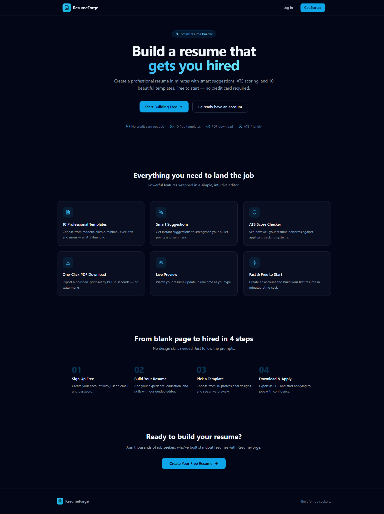
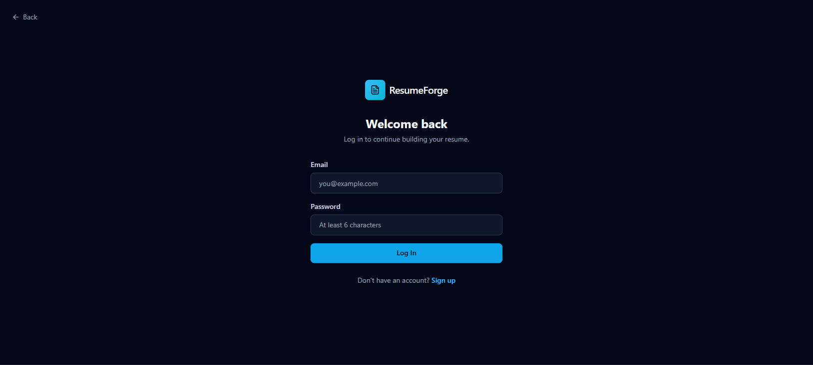
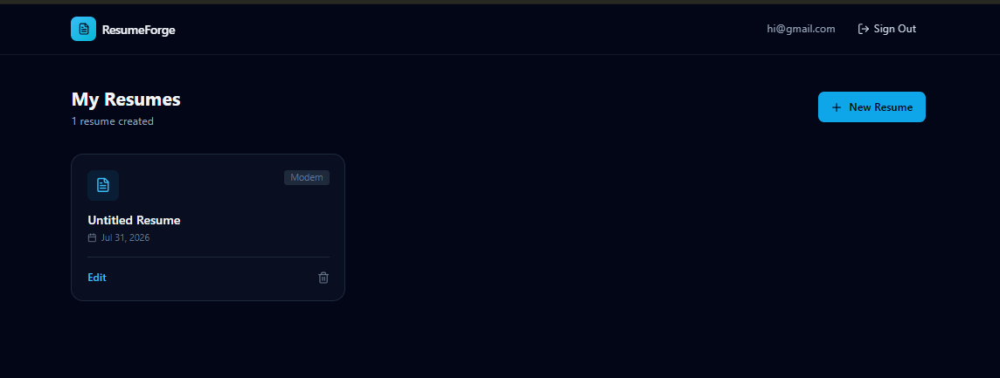
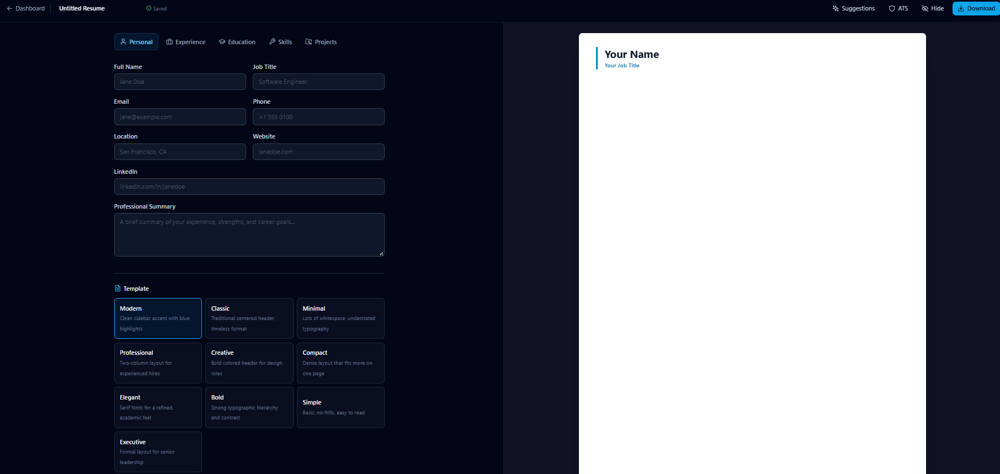

# ResumeForge — Resume Builder


ResumeForge is a resume builder that helps job seekers create professional, ATS-friendly resumes in minutes. Choose from 10 professional templates, get smart suggestions, check your ATS score, and download polished PDFs — free to start, no credit card required.

Built with React, TypeScript, Vite, Tailwind CSS, and Supabase.

---

## Table of Contents

- [Screenshots](#screenshots)
- [Features](#features)
- [Getting Started](#getting-started)
  - [Prerequisites](#prerequisites)
  - [Installation](#installation)
  - [Running the App](#running-the-app)
- [Docker Setup](#docker-setup)
- [Tech Stack](#tech-stack)
- [Project Structure](#project-structure)
- [How It Works](#how-it-works)
- [Environment Variables](#environment-variables)
- [Contributing](#contributing)
- [License](#license)

---

## Screenshots

### Landing Page


### Login Page


### Register Page


### Dashboard


### Editor


---

## Features

- **10 Professional Templates** — Choose from modern, classic, minimal, executive and more — all ATS-friendly.
- **Smart Suggestions** — Get instant suggestions to strengthen your bullet points and summary.
- **ATS Score Checker** — See how well your resume performs against applicant tracking systems.
- **One-Click PDF Download** — Export a polished, print-ready PDF in seconds — no watermarks.
- **Live Preview** — Watch your resume update in real time as you type.
- **Fast & Free to Start** — Create an account and build your first resume in minutes, at no cost.
- **User Dashboard** — Manage all your resumes in one place.
- **Responsive Design** — Optimized for desktop and mobile.

---

## Getting Started

### Prerequisites

- **Node.js** >= 18
- **npm** >= 9

### Installation

```bash
git clone https://github.com/yourusername/resume-builder.git
cd resume_builder
npm install
```

### Running the App

Start the development server:

```bash
npm run dev
```

Open your browser and navigate to `http://localhost:5173`.

---

## Docker Setup

Run ResumeForge with Docker for a consistent, isolated environment.

### Build and Run

```bash
docker compose up --build
```

The app will be available at `http://localhost:5173`.

### Stop the App

```bash
docker compose down
```

### Production Build

The Docker setup uses a multi-stage build:
1. **Builder stage** — Uses `node:20-alpine` to install dependencies and build the Vite production bundle.
2. **Production stage** — Uses `nginx:alpine` to serve the built assets with optimized caching and gzip compression.

---

## Tech Stack

| Technology | Purpose |
|------------|---------|
| **React 18** | UI library for building component-based interfaces |
| **TypeScript** | Type-safe JavaScript for better developer experience |
| **Vite 5** | Fast build tool and development server |
| **Tailwind CSS** | Utility-first CSS framework for rapid styling |
| **Supabase** | Backend, auth, and database |
| **Lucide React** | Beautiful, consistent icon set |

---

## Project Structure

```
resume_builder/
├── src/
│   ├── components/       # Reusable UI components
│   ├── context/          # React context providers (Auth)
│   ├── lib/              # Utilities, Supabase client, ATS logic, router
│   ├── pages/            # Route-level page components
│   │   ├── LandingPage.tsx
│   │   ├── AuthPage.tsx
│   │   ├── Dashboard.tsx
│   │   └── Editor.tsx
│   ├── types/            # TypeScript type definitions
│   ├── App.tsx           # Root component with routing
│   ├── main.tsx          # Application entry point
│   └── index.css         # Global styles and Tailwind directives
├── public/
├── .env
├── index.html
├── package.json
├── vite.config.ts
├── tailwind.config.js
├── postcss.config.js
├── tsconfig.json
├── Dockerfile
├── docker-compose.yml
├── .dockerignore
├── .gitignore
└── README.md
```

---

## How It Works

1. **Sign Up** — Create a free account with email and password.
2. **Build Your Resume** — Add your experience, education, and skills with our guided editor.
3. **Pick a Template** — Choose from 10 professional designs and see a live preview.
4. **Check ATS Score** — See how well your resume performs against applicant tracking systems.
5. **Download & Apply** — Export as PDF and start applying to jobs with confidence.

---

## Environment Variables

The app requires Supabase credentials. Create a `.env` file in the root:

```env
VITE_SUPABASE_URL=your-project-url
VITE_SUPABASE_ANON_KEY=your-anon-key
```

> **Note:** `.env` is ignored by git. Never commit real credentials.

---

## Contributing

Contributions are welcome! Please follow these steps:

1. Fork the repository
2. Create a feature branch (`git checkout -b feature/amazing-feature`)
3. Commit your changes (`git commit -m 'Add some amazing feature'`)
4. Push to the branch (`git push origin feature/amazing-feature`)
5. Open a Pull Request

---

## License

This project is open source and available under the MIT License.

---

Built with care by the ResumeForge team. Happy building!
